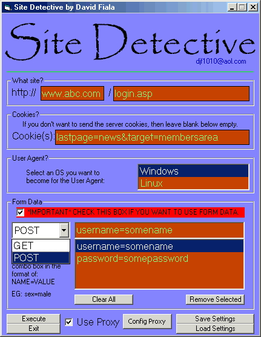



## Site Detective \- HTML code viewer and server headers viewer

### Description

This application lets you see servers headers when you visit thier site. Usually that information is hidden, but now its revealed. You also see the sites HTML source code. :) You can even use this behind a proxy!
 
### More Info
 
Site URL - and other optional options.

It returns the server headers and html source code.

No side effects

             |
---                |---
**Submitted On**   |2001-05-29 13:00:14
**By**             |[Close\_Account](https://github.com/Planet-Source-Code/PSCIndex/blob/master/ByAuthor/close-account.md)
**Level**          |Advanced
**User Rating**    |4.6 (32 globes from 7 users)
**Compatibility**  |VB 3\.0, VB 4\.0 \(16\-bit\), VB 4\.0 \(32\-bit\), VB 5\.0, VB 6\.0
**Category**       |[Complete Applications](https://github.com/Planet-Source-Code/PSCIndex/blob/master/ByCategory/complete-applications__1-27.md)
**World**          |[Visual Basic](https://github.com/Planet-Source-Code/PSCIndex/blob/master/ByWorld/visual-basic.md)
**Archive File**   |[Site Detec201685282001\.zip](https://github.com/Planet-Source-Code/close-account-site-detective-html-code-viewer-and-server-headers-viewer__1-23525/archive/master.zip)

### API Declarations

Download the zip

